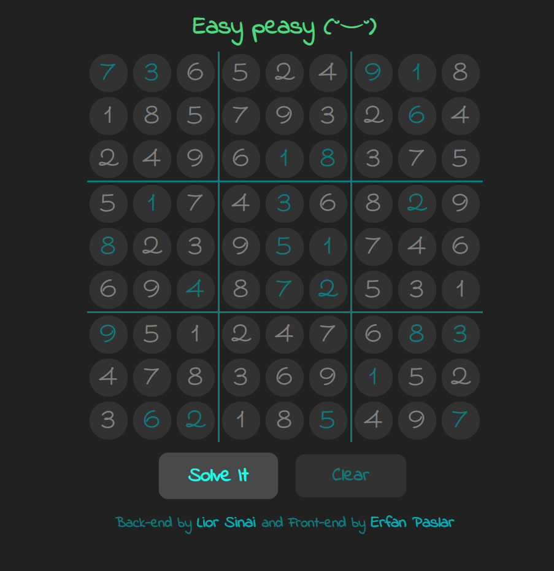

# SudokuSolver-Python

A Sudoku Solver in Python.

## Input
### Graphic User Interface

Run SudokuUI.py. This requires a web browser and the Python package [Eel](https://github.com/ChrisKnott/Eel) by Chris Knot. 
The latter can be installed with `pip install eel`.

<figure class="post-figure">

</figure>

Numbers can be freely entered into the grid spaces. Non-numeric inputs will be ignored. To delete a character, push `delete`. If there are any errors in the numbers e.g. duplicate numbers, this will be found while solving.

Blue characters are the user's input. Grey characters are computer generated. 
Solving and displaying results should take less than a second.

### Input files

A Sudoku in grid form:  
 [8, 9, 0, 0, 7, 0, 0, 1, 0]  
 [6, 2, 0, 0, 0, 3, 0, 5, 0]  
 [0, 0, 4, 0, 0, 0, 0, 0, 0]  
 [0, 6, 0, 0, 4, 0, 2, 0, 0]  
 [0, 0, 0, 0, 8, 5, 4, 3, 0]  
 [0, 0, 0, 1, 0, 0, 0, 0, 0]  
 [0, 0, 2, 7, 0, 0, 5, 0, 0]  
 [9, 0, 0, 2, 0, 0, 1, 0, 0]  
 [5, 0, 0, 4, 0, 0, 0, 0, 0]

It can be serialised by concatenating rows instead of stacking them:

> 890070010620003050004000000060040200000085430000100000002700500900200100500400000

This is more space efficient for storing multiple Sudokus.

The code has functionality to read in serialised Sudokus and convert them to a grid.

## Algorithm

To solve even the most challenging of these puzzles, our Sudoku solver only needs to follow three strategies:

1. If a square has only one candidate, place that value there.
2. If a candidate is unique within a row, box or column, place that value there (hidden singles).
3. If neither 1 or 2 is true in the entire grid, make a guess. Backtrack if the Sudoku becomes unsolvable.

The Sudoku Solver also implements other strategies. These can make the code run marginally faster:
- Hidden/naked pairs
- Hidden/naked triples
- Pointing pairs
- Box-line reduction (not working).

See [www.SudokuWiki.org][sudokuwiki] for more information on strategies.

[sudokuwiki]: https://www.sudokuwiki.org/

The code also implements a check to determine if the Sudoku is solvable. This is run at the start of each solving task.

## Credit

- User Interface: Erfan Paslar.
- ny.txt puzzles from [https://www.nytimes.com/puzzles/sudoku](https://www.nytimes.com/puzzles/sudoku) (no archives).
- top95.txt and hardest.txt from [https://norvig.com/sudoku.html](https://norvig.com/sudoku.html)

